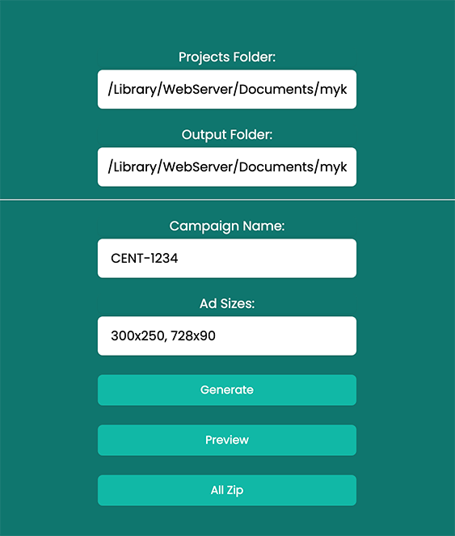
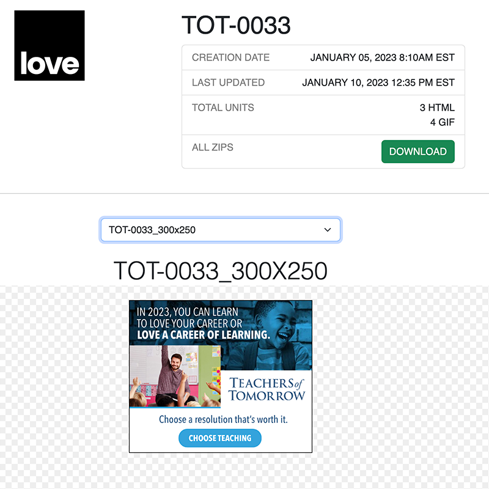

# Electron Ad Template

Electron application that allows you to create ad template.

<div style="display: flex; justify-content: center">

</div>

## Steps to craete ad tempaltes

1. Open the app and input the projects folder where you will edit the banner contents like: html, css, js, and images.
2. Input the destination folder in `Output Folder`, where you will create the output preview when you are done with the banner sizes.
3. Input project name in `Campaign Name`.
4. Click on `Generate` button to create templates for you banners.
5. When done with your banners, click on the `Preview` button to create preview index html.
6. Click on the `All Zipz` button to create a downloadale zip for you client.

<div style="display: flex; justify-content: center">

</div>

## Usage

Install dependencies:

```bash
$ npm install
```

Run:

```bash
$ npm start
```

You can also use `Electronmon` to constantly run and not have to reload after making changes

```bash
$ npx electronmon .
```

## Packaging

There are multiple ways to package Electron apps. I would suggest [Electron Forge](https://www.electronforge.io/). I did not implement any packaging into this app.

## Developer Mode

If your `NODE_ENV` is set to `development` then you will have the dev tools enabled and available in the menu bar. It will also open them by default.

When set to `production`, the dev tools will not be available.

### Future version

1. Add auto deploy in client's server
2. Add more template
